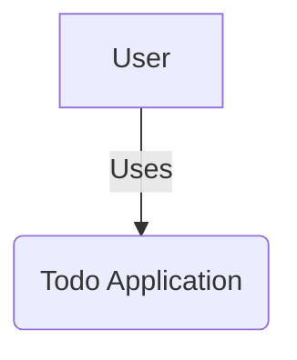
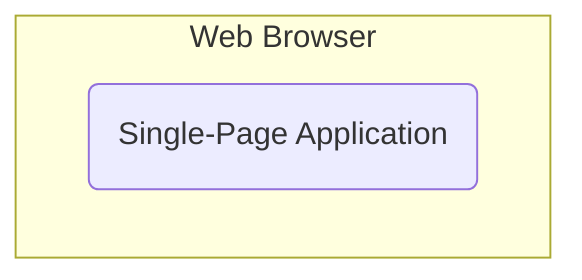
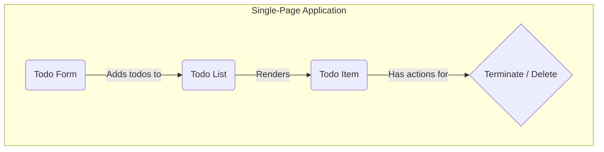
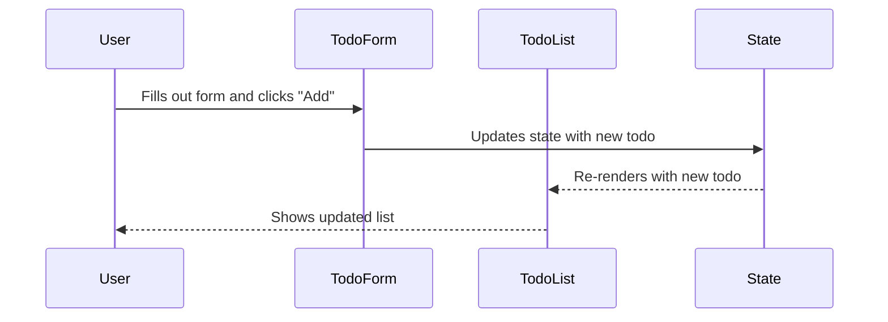

# Todo Application

This is a [Next.js](https://nextjs.org) project that provides a simple Todo application. The primary purpose of this project is to illustrate software architecture documentation using the C4 model.

## System Overview

The Todo application is a client-side only application that runs in a web browser. It allows users to add, view, terminate, and delete tasks. All data is stored in the browser's memory and is lost when the page is refreshed.

## C4 Model Diagrams

The following diagrams illustrate the architecture of the system using the C4 model.

### Level 1: System Context Diagram

This diagram shows the high-level view of the system, including the user and the main software system.



### Level 2: Container Diagram

This diagram zooms into the system boundary to show the high-level technical containers. In this case, the "container" is the Single-Page Application (SPA) running in the user's browser.



### Level 3: Component Diagram

This diagram breaks down the Single-Page Application into its main components.



## Sequence Diagram: Adding a Todo

This diagram shows the sequence of events that occur when a user adds a new todo item.




## Getting Started

First, run the development server:

```bash
npm run dev
# or
yarn dev
# or
pnpm dev
# or
bun dev
```

Open [http://localhost:3000](http://localhost:3000) with your browser to see the result.

You can start editing the page by modifying `app/page.tsx`. The page auto-updates as you edit the file.

This project uses [`next/font`](https://nextjs.org/docs/app/building-your-application/optimizing/fonts) to automatically optimize and load [Geist](https://vercel.com/font), a new font family for Vercel.
